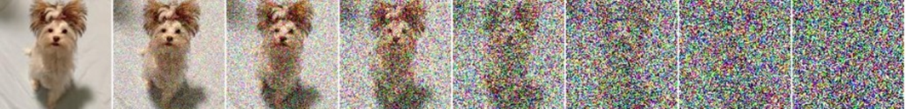

# Diffusion的公式推导

diffusion具体公式推导，网上教程很多，但是太难懂了

我就写一篇可以停留在我能理解的层面的

## 1 概述

Generative network本质上是要学习到数据的分布。

原生diffusion主要是通过在图片上加噪，再在有噪声的图像上想办法去噪。但是由于在仅已知当前的图像的情况下（加了t步噪声的图像），我们是无法推测出上一步的噪声的，所以要用其他的方式来推测（即用神经网络拟合）。由于加噪过程参数自己设定（已知），所以已知加噪的噪声真实值，通过预测噪声和真实噪声的区别来约束网络。在推理过程中，直接随机采样一张噪声图像，在其上使用刚刚的模型进行去噪，就可以达到生成图像的效果。

## 2 推导

### 2.1 加噪过程

加噪过程就是在前一步的图像的基础上加上一张随机采样的得到的噪声图像。

要理解这个所谓“采样“，是每次根据某个预设的概率分布来选择其中具体的一种可能。

加噪过程服从这样的公式:
$$
q(x_t|x_{t-1})=N(x_t;\sqrt{1-\beta_t}x_{t-1},\beta_tI)
$$
$q(x_t|x_{t-1})$就是已知$x_{t-1}$（t-1时刻的图像，即t-1次加噪后的图像）采样$x_t$（t时刻的图像）要服从什么分布来采样。后面的$N$表示服从正态分布，分号前表示采样的输出，分号后面第一项$\sqrt{1-\beta_t}x_{t-1}$和第二项$\beta_tI$分别表示正态分布的**均值**和**方差**。即$x_t$要从均值为$\sqrt{1-\beta_t}x_{t-1}$方差为$\beta_tI$的正态分布中采样获得。

正态分布可以归一化到$N(0,1)$，相当于可以把采样结果用$\epsilon \sim N(0,1)$来表示（前置知识为：当$z\sim N(\mu,\sigma^2)$时，$z=\mu+\sigma\epsilon$，其中$\epsilon \sim N(0,1)$）。同时，我们自己预设每一时刻$t-1$加噪的一个参数${\beta_t}$。我们就可以把$x_t$表示成下面的式子
$$
x_t=\sqrt{1-\beta_t}x_{t-1}+\sqrt{\beta_t}\epsilon_{t-1}
$$
其中$\epsilon_{t-1}$就是当前在$N(0,1)$采样得到的噪声，以此来表示$x_t$。

接下来我们可以递推得到$x_t$与$x_0$（即原图）的关系：（令$\alpha_t=1-\beta_t$）
$$
\begin{aligned}
x_t&=\sqrt\alpha_tx_{t-1}+\sqrt{1-\alpha_t}\epsilon_{t-1}\\
&=\sqrt\alpha_t(\sqrt\alpha_{t-1}x_{t-2}+\sqrt{1-\alpha_{t-1}}\epsilon_{t-2})+\sqrt{1-\alpha_t}\epsilon_{t-1}\\
&=\sqrt{\alpha_t\alpha_{t-1}}x_{t-2}+\sqrt{\alpha_t(1-\alpha_{t-1})}\epsilon_{t-2}+\sqrt{1-\alpha_t}\epsilon_{t-1}
\end{aligned}
$$
这个时候引入正态分布的加和定理（我自己取的名字）：当$X\sim N(\mu_X,\sigma_X^2),Y\sim N(\mu_Y,\sigma_Y^2)$时，$Z=X+Y\sim N(\mu_X+\mu_Y, \sigma_X^2+\sigma_Y^2)$

根据这个定理，我们可以把$\epsilon_{t-2}$看成$X\sim N(0,\alpha_t(1-\alpha_{t-1}))$，把$\epsilon_{t-1}$看成$Y\sim N(0,1-\alpha_t)$（怎么能看成这个又是一个定理，懒得写了），那么他们可以合并为$Z\sim N(0,1-\alpha_t\alpha_{t-1})$，即可表示为
$$
\begin{aligned}
x_t&=\sqrt{\alpha_t\alpha_{t-1}}x_{t-2}+\sqrt{\alpha_t(1-\alpha_{t-1})}\epsilon_{t-2}+\sqrt{1-\alpha_t}\epsilon_{t-1}\\
&=\sqrt{\alpha_t\alpha_{t-1}}x_{t-2}+\sqrt{1-\alpha_t\alpha_{t-1}}\epsilon
\end{aligned}
$$
继续递推，可得
$$
x_t=\sqrt{\alpha_t\alpha_{t-1}\cdots\alpha_1}x_0+\sqrt{1-\alpha_t\alpha_{t-1}\cdots\alpha_1}\epsilon
$$
为了化简此式，我们再令$\bar\alpha_t=\alpha_t\alpha_{t-1}\cdots\alpha_1$，即有
$$
x_t=\sqrt{\bar\alpha_t}x_0+\sqrt{1-\bar\alpha_t}\epsilon
$$
其中$\epsilon\sim N(0,1)$

### 2.2 逆推（去噪）过程

逆推的时候就是要求$q(x_{t-1}|x_t)$，即已知$x_{t}$采样$x_{-1}$要服从什么分布来采样，我们还是利用数学知识，也就是**贝叶斯公式**：
$$
q(x_{t-1}|x_t,x_0)=\frac{q(x_t|x_{t-1},x_0)q(x_{t-1}|x_0)}{q(x_t|x_0)}
$$
贝叶斯公式左侧为所求（先不管为啥我多了个$x_0$），右侧三项可分别表示为

1. $q(x_t|x_{t-1},x_0)=\sqrt{\alpha_t}x_{t-1}+\sqrt{1-\alpha_t}\epsilon$，均值为$\sqrt{\alpha_t}x_{t-1}$，方差为$1-\alpha_t$
2. $q(x_{t-1}|x_0)=\sqrt{\bar\alpha_{t-1}}x_0+\sqrt{1-\bar\alpha_{t-1}}\epsilon$，略
3. $q(x_t|x_0)=\sqrt{\bar\alpha_t}x_0+\sqrt{1-\bar\alpha_t}\epsilon$，略

由于正态分布是$\propto\exp(-\frac{(x-\mu)^2}{2\sigma^2})$，所以代入右式有（原来的乘除变成指数上的加减）
$$
q(x_{t-1}|x_t,x_0)\propto\exp\left(-\frac12\left(\frac{(x_t-\sqrt{\alpha_t}x_{t-1})^2}{1-\alpha_t}+\frac{(x_{t-1}-\sqrt{\bar\alpha_{t-1}}x_0)^2}{1-\bar\alpha_{t-1}}+\frac{(x_t-\sqrt{\bar\alpha_t}x_0)^2}{1-\bar\alpha_t}\right)\right)
$$
平方展开右式
$$
\frac{(x_t-\sqrt{\alpha_t}x_{t-1})^2}{1-\alpha_t}+\frac{(x_{t-1}-\sqrt{\bar\alpha_{t-1}}x_0)^2}{1-\bar\alpha_{t-1}}+\frac{(x_t-\sqrt{\bar\alpha_t}x_0)^2}{1-\bar\alpha_t}
$$
有
$$
\frac{x_t^2-2\sqrt{\alpha_t}x_tx_{t-1}+\alpha_tx_{t-1}^2}{1-\alpha_t}+\frac{x_{t-1}^2-2\sqrt{\bar\alpha_{t-1}}x_{t-1}x_0+\bar\alpha_{t-1}x_0^2}{1-\bar\alpha_{t-1}}+\frac{x_t^2-2\sqrt{\bar\alpha_t}x_tx_0+\bar\alpha_tx_0^2}{1-\bar\alpha_t}
$$
我们要找这个式子中$x_{t-1}$的规律，也就是这个式子里应该有形如$\frac{(x_{t-1}-\mu)^2}{2\sigma^2}$的东西，我们可以提取$x_{t-1}$的同类项有
$$
\left(\frac{\alpha_t}{1-\alpha_t}+\frac{1}{1-\bar\alpha_{t-1}}\right)x_{t-1}^2-\left(\frac{2\sqrt{\alpha_t}x_t}{1-\alpha_t}+\frac{2\sqrt{\bar\alpha_{t-1}}x_0}{1-\bar\alpha_{t-1}}\right)x_{t-1}+C
$$
其中C为配方剩下的常数项，具体是啥不重要

根据$\frac{(x_{t-1}-\mu)^2}{2\sigma^2}=\frac1{\sigma^2}x_{t-1}^2-\frac{2\mu}{\sigma^2}x_{t-1}+\frac{\mu^2}{\sigma^2}$，有
$$
\begin{cases}
\frac1{\sigma^2}=\frac{\alpha_t}{1-\alpha_t}+\frac{1}{1-\bar\alpha_{t-1}}\\
\frac{2\mu}{\sigma^2}=\frac{2\sqrt{\alpha_t}x_t}{1-\alpha_t}+\frac{2\sqrt{\bar\alpha_{t-1}}x_0}{1-\bar\alpha_{t-1}}
\end{cases}
$$
解得
$$
\begin{aligned}
\mu&=\mu_t(x_t,x_0)\\
&=\frac{\sqrt{\alpha_t}(1-\bar\alpha_{t-1})}{1-\bar\alpha_t}x_t+\frac{\sqrt{\bar\alpha_{t-1}}(1-\alpha_t)}{1-\bar\alpha_t}x_0
\end{aligned}
$$
我们就可以根据$x_t,x_0$采样出$x_{t-1}$（不难发现$\sigma^2$与$x_t,x_0$无关，这里也不再推导）

但是有一个很严重的问题，就是现在$x_0$并非是已知条件，但是我们之前已经求得了$x_t$和$x_0$的关系（2.1小节最后的公式），即
$$
x_t=\sqrt{\bar\alpha_t}x_0+\sqrt{1-\bar\alpha_t}\epsilon
$$
反过来把$x_0$用$x_t$表示有
$$
x_0=\frac{x_t-\sqrt{1-\bar\alpha_t}\epsilon}{\sqrt{\bar\alpha_t}}
$$
代回$\mu_t(x_t,x_0)$有
$$
\mu_t(x_t)=\frac1{\sqrt{\alpha_t}}\left(x_t-\frac{1-\alpha_t}{\sqrt{1-\bar\alpha_t}}\epsilon_t\right)
$$
那么现在，知道了回推过程均值和方差，回推采样就可以实现了

### 2.3 训练过程

2.2节中最后的公式，我们是已知$x_t$和$\alpha_t$的，但是$\epsilon_t$我们未知

我们就是用神经网络模型$\epsilon_\theta(x_t,t)$去拟合这个$\epsilon_t$，网络输入是$x_t,t$，即已知某一时刻加噪的图像，以及加噪的程度（加了多少步），推测这个加噪的图像中上一步加的噪声是啥

由于前向（加噪）过程是人为操作，所以我是已知每一步的真实噪声的，所以将网络输出与真实输出计算MSE作为网络优化的约束即可

1. 随机选定一个时间步$t\in\{1,2,\cdots,T\}$
2. 根据$x_t=\sqrt{\bar\alpha_t}x_0+\sqrt{1-\bar\alpha_t}\epsilon$加噪获得该时刻的噪声图像
3. 将噪声图像和时间步的embedding输入网络，预测噪声，以

为了为生成做一些预设，我们还可以为该网络添加条件，比如Semantic Map, Text, Images等等，通过编码器接入作为条件信息

### 2.4 推理过程

训练好模型$\epsilon^*(x_t,t)$之后，我们就需要将模型用于推理了，即生成同类型的图片

我们随机采样一个服从$N(0,1)$的图片即可，输入网络告诉他这是第T步的图片，以及步数T，他就会帮你去噪得到上一步的图像，去噪过程（即逆向采样）可以表示为
$$
x_{t-1}=\frac1{\sqrt{\alpha_t}}\left(x_t-\frac{1-\alpha_t}{\sqrt{1-\bar\alpha_t}}\epsilon^*(x_t,t)\right)+\sqrt{\beta_t}z
$$
其中$z\sim N(0,1)$